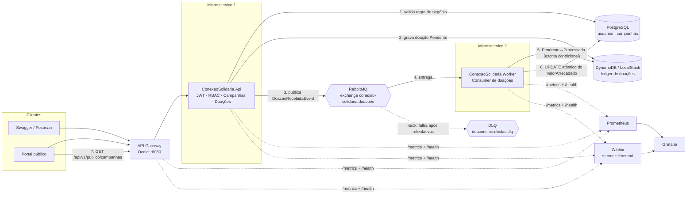
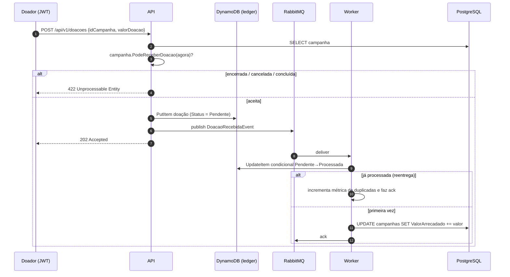

# Arquitetura — Conexão Solidária

## Visão geral



## Por que dois microsserviços

| | ConexaoSolidaria.Api | ConexaoSolidaria.Worker |
|---|---|---|
| Responsabilidade | Superfície HTTP: autenticação, RBAC, CRUD de campanhas, painel público, aceite de intenções de doação | Consumo da fila e consolidação financeira |
| Perfil de carga | Picos de leitura no painel público | Vazão de escrita, tolerante a latência |
| Escala | `replicas: 2`, escala por requisições HTTP | `replicas: 2`, escala pelo tamanho da fila |
| Falha isolada | Se o Worker cair, a API continua aceitando doações — elas ficam enfileiradas | Se a API cair, o Worker segue drenando o backlog |

A API **nunca** escreve em `ValorArrecadado`. Essa é a fronteira que garante o requisito de comunicação assíncrona: a resposta ao doador é `202 Accepted` com a doação em `Pendente`, e a consolidação acontece fora do ciclo da requisição.

## Fluxo da doação em detalhe



### Idempotência

O broker garante *at-least-once*: a mesma mensagem pode chegar duas vezes. A transição `Pendente → Processada` no DynamoDB usa `ConditionExpression`, então apenas a primeira entrega passa adiante e credita a campanha. Reentregas caem no ramo de duplicidade e são descartadas com `ack`, sem somar valor duas vezes.

### Concorrência

Com duas réplicas do Worker consumindo em paralelo, o incremento usa `ExecuteUpdate` (`SET ValorArrecadado = ValorArrecadado + @valor`) — um `UPDATE` atômico no PostgreSQL, sem *read-modify-write* na aplicação e sem perda de escrita.

### Falhas

Erro no processamento → `BasicNack(requeue: false)` → a fila `doacoes.recebidas` tem `x-dead-letter-exchange` configurada e a mensagem cai em `doacoes.recebidas.dlq` para inspeção manual. No provider AWS o equivalente é a `RedrivePolicy` com `maxReceiveCount: 5`.

## Broker plugável

`IEventPublisher` / `IEventConsumer` têm duas implementações selecionadas por configuração (`Messaging:Provider`):

| Provider | Publicação | Consumo | Quando usar |
|---|---|---|---|
| `RabbitMq` (padrão) | exchange tópico `conexao-solidaria.doacoes` | fila `doacoes.recebidas` com DLQ | Ambiente do hackathon, requisito obrigatório |
| `Aws` | SNS `doacoes-recebidas` | SQS `doacoes-recebidas` (long polling) com DLQ | Cenário de nuvem; roda contra **LocalStack** localmente e contra a AWS real apenas apagando `Aws:ServiceUrl` |

Trocar de um para o outro é uma variável de ambiente — nenhuma linha de domínio muda.

## AWS via LocalStack

Todo recurso AWS do projeto é emulado pelo LocalStack (`localhost:4566`), sem nenhuma conta ou custo:

| Serviço | Uso | Provisionamento |
|---|---|---|
| DynamoDB | Tabela `doacoes` (PK `CampanhaId`, SK `DoacaoId`, GSI `doador-index`) | `deploy/localstack/01-provision-aws.sh` + `DynamoDbInitializer` idempotente no startup |
| SNS | Tópico `doacoes-recebidas` (provider `Aws`) | `AwsMessagingTopology` no startup |
| SQS | Fila `doacoes-recebidas` + DLQ, assinada no tópico com `RawMessageDelivery` | `AwsMessagingTopology` no startup |

`Aws:ServiceUrl` vazio faz os clientes usarem os endpoints reais da AWS com a cadeia de credenciais padrão — o mesmo binário serve os dois ambientes.

## Observabilidade

- Todos os serviços expõem `/health/live`, `/health/ready` e `/metrics` (formato Prometheus).
- A API adiciona métricas HTTP (`http_requests_received_total`, `http_request_duration_seconds`) via `prometheus-net`.
- Métricas de negócio, em `MetricasDoacao`: doações recebidas, processadas, rejeitadas por motivo, duplicadas, falhas, latência de processamento e valor consolidado.

**Duas ferramentas, uma instrumentação.** Prometheus e Zabbix consomem exatamente os mesmos endpoints; a aplicação não sabe da existência de nenhum dos dois:

| | Prometheus | Zabbix |
|---|---|---|
| Coleta | Scrape de `/metrics` a cada 10s | Item HTTP agent lê `/metrics` a cada 30s |
| Derivação | PromQL na consulta | *Preprocessing* com padrão Prometheus nativo, um item por métrica |
| Papel | Séries temporais de alta resolução para análise | Estado dos serviços, triggers e alertas operacionais |
| No Grafana | Datasource `PROM` → dashboard *Conexão Solidária - Plataforma* | Datasource `ZABBIX` → dashboard *Conexão Solidária - Zabbix* |

O Zabbix não usa agente dentro dos pods da aplicação: um único item HTTP por serviço busca o `/metrics` e todos os demais itens derivam dele, o que evita 30 requisições onde uma basta. Os hosts, itens e triggers são criados por `deploy/zabbix/provisionar.py` via API JSON-RPC, de forma idempotente.

A trigger mais relevante para esta arquitetura cruza os dois hosts:

```
last(/Conexao Solidaria API/doacoes.recebidas) - last(/Conexao Solidaria Worker/doacoes.processadas) > 50
```

Ela alerta quando o Worker deixa de drenar a fila no ritmo em que a API aceita doações — o sintoma operacional direto do desacoplamento assíncrono.

- O dashboard `deploy/grafana/dashboards/conexao-solidaria.json` é provisionado automaticamente e mostra o descolamento entre "recebidas" (API) e "processadas" (Worker) — a evidência visual do processamento assíncrono — além de CPU/memória por serviço e do tráfego HTTP.
- O dashboard `conexao-solidaria-zabbix.json` traz o mesmo fluxo pela ótica do Zabbix, com status dos serviços e o painel de problemas ativos.

## Portas

| Serviço | Docker Compose | Kubernetes (NodePort) |
|---|---|---|
| API | http://localhost:5080 | 30080 |
| Worker | http://localhost:5081 | — (ClusterIP) |
| Gateway (Ocelot) | http://localhost:8080 | 30081 |
| RabbitMQ Management | http://localhost:15672 | 31567 |
| Prometheus | http://localhost:9090 | 30090 |
| Grafana | http://localhost:3000 | 30300 |
| Zabbix | http://localhost:8090 | 30909 |
| LocalStack | http://localhost:4566 | — (ClusterIP) |
